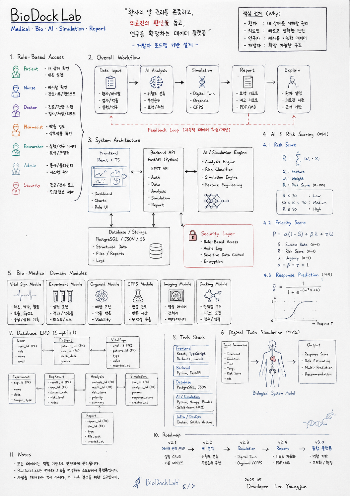
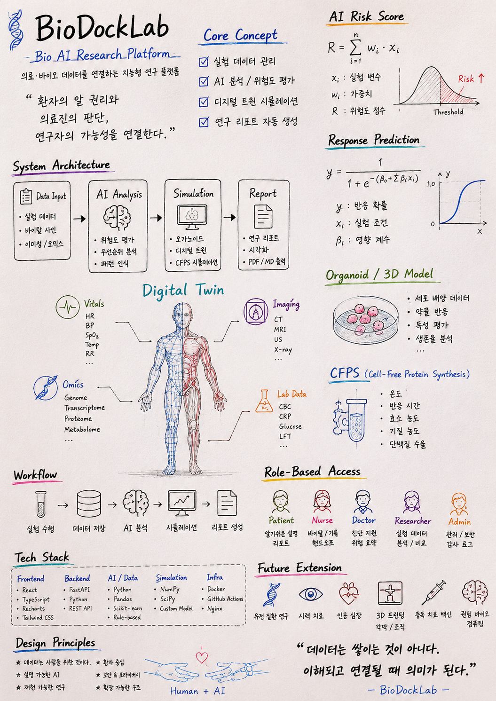

# BioDockLab

**Bio AI Research Software Platform**  
Experiment Data · AI Analysis · Digital Twin Simulation · Research Reports

> **Grand Prize Winner** — Future Government Innovation Idea Contest  
> **Selected** — University Startup Support Program

---

## Overview

**BioDockLab** is a bio AI research software platform for managing experiment data, analyzing experimental outcomes, simulating biological responses, and generating research reports.

The project is designed as a lightweight research-assistant system that connects biological experiment records with AI-based analysis and digital twin-style simulation.

**BioDockLab is not a medical device or diagnostic system.**  
It is a software prototype for research workflow exploration.

---

## Core Workflow

Experiment Data  
→ AI Analysis  
→ Risk / Priority Evaluation  
→ Digital Twin Simulation  
→ Research Report

---

## Key Features

### Experiment Data Management

- Experiment records
- Sample tracking
- Condition management
- Observation results
- Research notes

### AI-Based Analysis

- Risk classification
- Priority scoring
- Experiment summary
- Recommendation logic
- ML-ready feature structure

### Digital Twin Simulation

- Parameter-based response simulation
- Organoid response simulation
- CFPS yield simulation
- Biological response estimation

### Research Report Generation

- Experiment overview
- AI analysis result
- Risk and priority evaluation
- Simulation result summary
- Markdown / PDF report direction

---

## Hand-Drawn System Concept

Before implementation, BioDockLab was organized through hand-drawn system sketches to clarify the platform architecture, medical/bio data flow, AI analysis layer, simulation direction, and role-based access model.

### System Overview

### Medical / Bio AI Map

More details: [Handdrawn System Concept](docs/architecture/Handdrawn_System_Concept.md)

---

## Tech Stack

### Frontend

- **React**
- **TypeScript**
- **Recharts**
- **Lucide React**

### Backend

- **Python**
- **FastAPI**
- **JSON-based sample data**

### AI / Simulation

- **Rule-based experiment analysis**
- **Risk classification**
- **Feature engineering structure**
- **Digital twin-style simulation**
- **Organoid response simulation**
- **CFPS yield estimation**

### Documentation

- **Markdown**
- **Research notes**
- **Development notes**
- **Report templates**

---

## Project Structure

- `ai/` — Experiment analysis and risk classification
- `backend/` — FastAPI backend prototype
- `bio/` — Bio-domain logic
- `docs/` — Development notes and technical documents
- `frontend/` — Dashboard and UI prototype
- `reports/` — Report output and templates
- `sample_data/` — Sample experiment datasets
- `scripts/` — Utility and automation scripts
- `simulation/` — Digital twin, organoid, and CFPS simulation
- `viewer/` — Data viewer prototype

---

## Documentation

### API

- [API Overview](docs/api/README.md)
- [API Boundary](docs/api/API_BOUNDARY.md)
- [API Specification](docs/api/api_spec.md)
- [Research API Specification](docs/api/research_api_spec.md)

### Architecture

- [System Context](docs/architecture/SYSTEM_CONTEXT.md)
- [Data Flow](docs/architecture/DATA_FLOW.md)
- [Module Map](docs/architecture/MODULE_MAP.md)
- [Handdrawn System Concept](docs/architecture/Handdrawn_System_Concept.md)
- [Backend Structure](docs/architecture/backend_structure.md)
- [Technical Stack Roadmap](docs/architecture/TECH_STACK_ROADMAP.md)

### Research

- [Related Work](docs/research/related_work.md)
- [Research Tool Direction](docs/research/research_tool_direction.md)
- [Bio Future Watch](docs/research/BIO_FUTURE_WATCH.md)
- [Digital Twin](docs/research/DIGITAL_TWIN.md)
- [Organoid Research](docs/research/ORGANOID.md)
- [CFPS](docs/research/CFPS.md)
- [Surgery AI](docs/research/SURGERY_AI.md)
- [Quantum Biocomputing](docs/research/QUANTUM_BIOCOMPUTING.md)

### Business

- [Business Overview](docs/business/README.md)
- [Business Boundary](docs/business/BUSINESS_BOUNDARY.md)
- [Business Model](docs/business/business_model.md)

### Evidence

- [Evidence Overview](docs/evidence/README.md)
- [Award Summary](docs/evidence/AWARD_SUMMARY.md)
- [Presentation Summary](docs/evidence/PRESENTATION_SUMMARY.md)
- [Startup Support Summary](docs/evidence/STARTUP_SUPPORT_SUMMARY.md)

### Planning

- [Project Plan](docs/planning/PROJECT_PLAN.md)
- [MVP Specification](docs/planning/MVP_SPEC.md)
- [Role Assignment](docs/planning/ROLE_ASSIGNMENT.md)

### Decisions

- [Architecture Decision Records](docs/decisions/README.md)
- [ADR-001: Why FastAPI](docs/decisions/ADR-001_Why_FastAPI.md)
- [ADR-002: Why Rule-Based MVP](docs/decisions/ADR-002_Why_RuleBased_MVP.md)
- [ADR-003: Why Digital Twin Direction](docs/decisions/ADR-003_Why_Digital_Twin_Direction.md)
- [ADR-004: Why Modular Architecture](docs/decisions/ADR-004_Why_Modular_BioDockLab_Architecture.md)

### Validation

- [Validation Overview](docs/validation/README.md)
- [Validation Status](docs/validation/VALIDATION_STATUS.md)
- [Assumptions](docs/validation/ASSUMPTIONS.md)
- [Known Limitations](docs/validation/KNOWN_LIMITATIONS.md)

### Operations

- [Operations Overview](docs/operations/README.md)
- [Local Setup](docs/operations/LOCAL_SETUP.md)
- [Developer Guide](docs/operations/DEVELOPER_GUIDE.md)
- [Deployment Notes](docs/operations/DEPLOYMENT.md)

### Ethics & Security

- [Claim Boundary](docs/ethics/claim_boundary.md)
- [Ethics Boundary](docs/ethics/ETHICS_BOUNDARY.md)
- [AI Claim Policy](docs/ethics/AI_CLAIM_POLICY.md)
- [Security Policy](docs/security/README.md)
- [Security Boundary](docs/security/SECURITY_BOUNDARY.md)
- [Data Protection](docs/security/DATA_PROTECTION.md)
- [Threat Model](docs/security/threat_model_v0.1.md)

### Team

- [Team Overview](docs/team/TEAM_OVERVIEW.md)
- [Team Roles](docs/team/TEAM_ROLES.md)
- [Collaboration Guide](docs/team/COLLABORATION_GUIDE.md)
- [Open Positions and Skills](docs/team/OPEN_POSITIONS_AND_SKILLS.md)

### Roadmap

- [Implementation Roadmap](docs/roadmap/IMPLEMENTATION_ROADMAP.md)
- [Commercialization Roadmap](docs/roadmap/COMMERCIALIZATION_18_36_MONTH_ROADMAP.md)

---

## Current Status

BioDockLab is currently in the **MVP / prototype stage**.

Implemented or partially implemented:

- FastAPI backend prototype
- Experiment sample data structure
- Experiment list / detail API
- Rule-based experiment analyzer
- Risk classifier
- Digital twin simulation function
- Organoid response simulator
- CFPS yield simulator
- Dashboard prototype
- Development documentation

---

## MVP Target

Experiment Data Registration  
→ AI Risk Analysis  
→ Digital Twin Prediction  
→ Dashboard Visualization  
→ Research Report Generation

---

## Roadmap

### v2.1 — Experiment Data MVP

- Clean up sample data schema
- Add experiment CRUD logic
- Connect dashboard to backend data

### v2.2 — AI Analysis Layer

- Add AI analysis API endpoint
- Return risk classification result
- Generate experiment summary

### v2.3 — Digital Twin MVP

- Add digital twin simulation API
- Visualize simulation result in dashboard
- Connect organoid and CFPS simulation logic

### v2.4 — Research Report System

- Generate Markdown report
- Include AI analysis result
- Include simulation result
- Prepare PDF export structure

### v3.0 — Bio AI Research Platform

- Integrated research dashboard
- Experiment comparison view
- Digital twin simulation screen
- Automated report export

---

## Limitations

BioDockLab is still an early-stage research software prototype.

Current limitations:

- Experiment CRUD is not fully implemented yet
- AI analysis is currently rule-based
- Digital twin simulation is still function-level
- Frontend and backend are not fully integrated
- Real biological validation has not been performed
- Medical or clinical use is not supported

---

## Author

**Lee Youngjun**  
Department of Computer Science, Paejae University  
GitHub: [@gxmzung](https://github.com/gxmzung)

---

## Disclaimer

BioDockLab is a **research software prototype**.

It is **not** a medical device, diagnostic tool, clinical decision-making system, or validated biological prediction system.

All simulation and analysis results are for software demonstration and research workflow exploration only.
