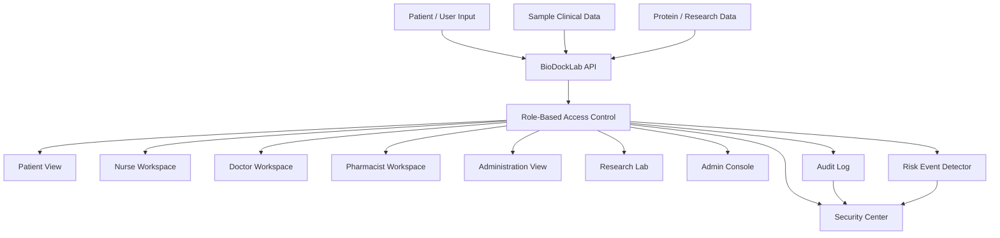
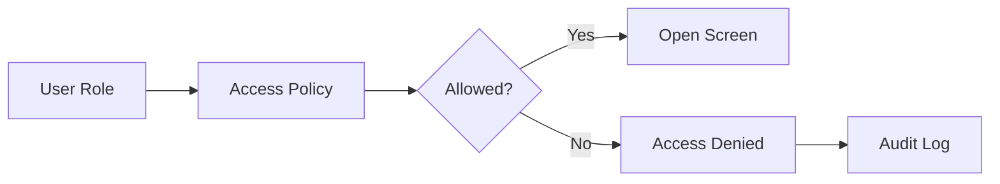
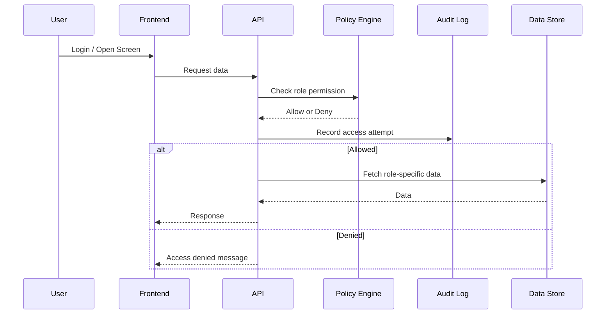

# BioDockLab Implementation Architecture

## 1. 시스템 개요

BioDockLab은 EMR을 대체하는 시스템이 아니라, 의료·바이오 데이터를 역할별로 설명하고 접근을 통제하는 보조 플랫폼이다.

핵심 구조:

---

## 2. 핵심 모듈

## 2.1 Authentication Module

역할:

- 로그인
- 회원가입
- 역할 부여
- 세션 관리
- 관리자 계정 분리

초기 구현:

- 샘플 계정 기반 로그인

MVP 목표:

- 서버 기반 인증
- 비밀번호 해시
- 세션/JWT
- 관리자 권한 분리

---

## 2.2 Role-Based Access Control Module

역할:

- 환자/간호사/의사/약사/원무/연구자/보안관리자별 접근 제어
- 권한 없는 화면 차단
- 접근 시도 기록

구조:

---

## 2.3 Patient Explanation Module

역할:

- 검사결과 쉬운 설명
- 상담 준비 질문 생성
- 환자용 리포트
- 위험 표현 제한

주의:

- 진단 아님
- 처방 아님
- 의료진 판단 대체 아님

---

## 2.4 Nurse Workspace Module

역할:

- 바이탈 요약
- 인수인계 요약
- 투약 전 확인
- 환자 설명 상태 확인
- 동의 상태 확인

주의:

- EMR 대체 아님
- 간호기록 대체 아님
- 인수인계 보조 화면

---

## 2.5 Doctor Summary Module

역할:

- 환자 상담 전 요약
- 주요 검사결과 정리
- 환자 질문 리스트 확인
- 설명 리포트 확인

---

## 2.6 Pharmacist Review Module

역할:

- 처방량 확인
- 병용약 확인
- 약물상호작용 확인
- 유전자 적합성 정보 참고
- 복약지도 포인트 정리

---

## 2.7 Administration Module

역할:

- 예약 상태
- 동의서 상태
- 서류 발급 상태
- 민감정보 마스킹
- 보험/청구 확장 가능성

---

## 2.8 Research Lab Module

역할:

- 단백질 타겟 선택
- 후보 화합물 선택
- 도킹 결과 확인
- 실험 파라미터 확인
- 연구 리포트 생성

주의:

- 실제 신약 개발 완료 아님
- 임상 효능 보장 아님
- 교육·연구 보조

---

## 2.9 Protein Atlas Module

역할:

- 단백질 구조 정보
- 변이 정보
- 질환 연결
- 후보 리간드
- 용어 설명
- Research Lab 연동

---

## 2.10 Security Center Module

역할:

- 접근 로그 확인
- 권한 없는 접근 이벤트 확인
- 내부자 과다열람 의심 이벤트 확인
- 정책 점검
- 보안 리포트 생성

---

## 3. 데이터 흐름

---

## 4. 상용화 전 필수 개선

1. 실제 인증 시스템
2. 서버 기반 권한 강제
3. 비밀번호 해시
4. DB 암호화
5. 접근 로그 위변조 방지
6. MFA
7. 관리자 권한 이력 관리
8. 개인정보 비식별화
9. 의료 표현 검수
10. 법률/개인정보 검토